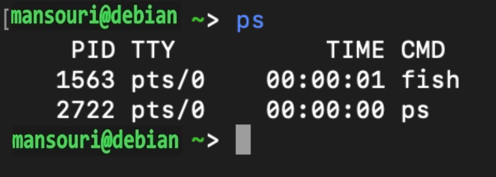
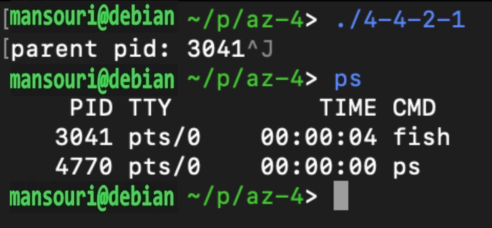
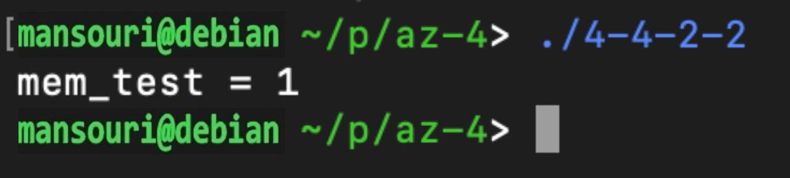
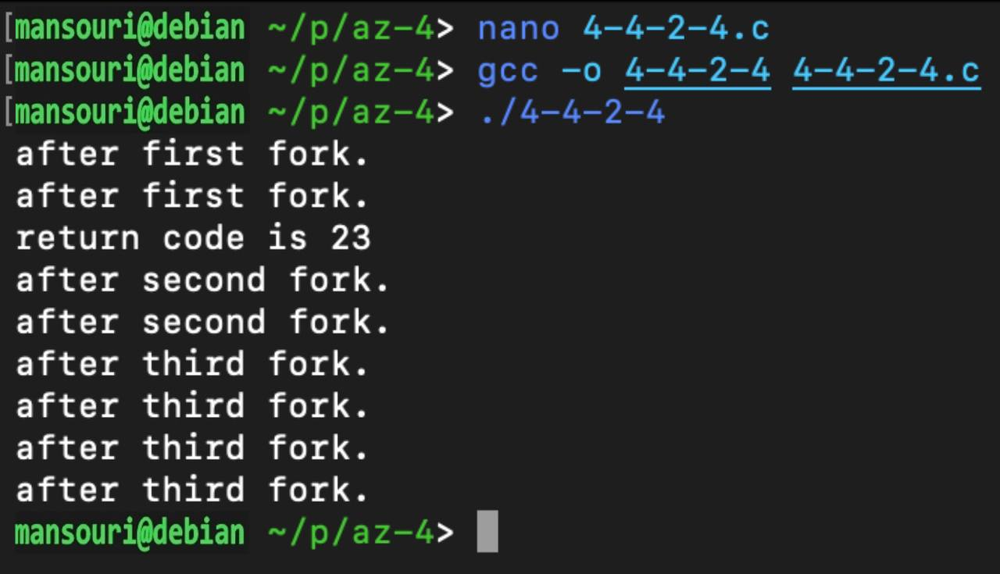
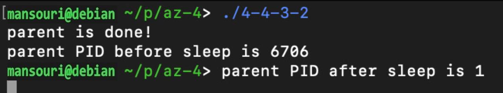
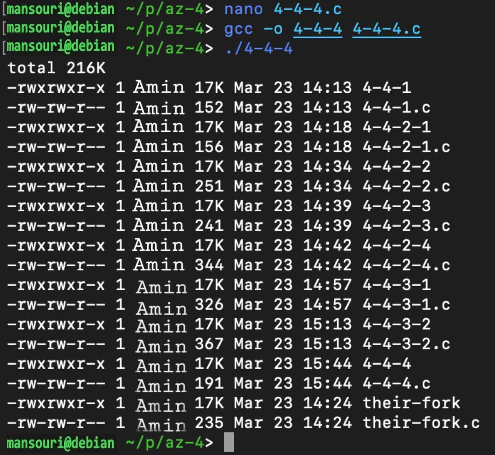

Team Name: 966127035

Student Name of member 1: amin mansouri

Student No. of member 1: 966127035

- [X] Read Session Contents.

### Section 4.4.1
- [X] Investigate the ps command
    1. [X] [FILL HERE with an image of ps command showing running processes.]

- [X] Infromation about processes with PID = 1
    1. [X] [FILL HERE with description.]

> Process ID 1 is usually the init process primarily responsible for starting and shutting down the system. Originally, process ID 1 was not specifically reserved for init by any technical measures: it simply had this ID as a natural consequence of being the first process invoked by the kernel.

- [X] Program using getpid
    1. [X] [FILL HERE with your program code.]

c
#include <stdio.h>
#include <sys/types.h>
#include <unistd.h>

int main(){
    int self_pid = getpid();
    printf("pid: %d\n", self_pid);
    return 0;
}

### Section 4.4.2

- [X] Program using getppid
    1. [X] [FILL HERE with your program code.]
c
#include <stdio.h>
#include <sys/types.h>
#include <unistd.h>

int main(){
    int parent_pid = getppid();
    printf("parent pid: %d\n", parent_pid);
    return 0;
}

1. [X] [FILL HERE with descriptions about the parent process]

This is the PID of the current terminal (we are using fish)

1. [X] [FILL HERE with an image of the program execution]

- [X] Describe the C program (fork program)
    1. [X] [FILL HERE with descriptions]

> first of all WEXITSTATUS is a macro used for getting the return code of a child process; and we know that child process will execute in if clause and parent will execute in else clause. so with wait statement parent will wait for child to finish its process and child return 23. so with WEXITSTATUS macro output in console will be "return code is 23"

- [X] Program showing that memory of the parent and the child is seperate
    1. [X] [FILL HERE with your source code]

c
#include <stdio.h>
#include <sys/wait.h>
#include <unistd.h>

int main() {
  int ret = fork();
  int mem_test = 1;
  if (ret == 0) {
    mem_test = 2;
    return 23;
  } else {
    int rc = 0;
    wait(&rc);
    printf("mem_test = %d\n", mem_test);
  }
  return 0;
}

> it will print 1 cause memory is separate in child and parent processes

- [X] Program printing different messages for parent and child process
    1. [X] [FILL HERE with your source code]

c
#include <stdio.h>
#include <sys/wait.h>
#include <unistd.h>

int main() {
  int ret = fork();
  if (ret == 0) {
    printf("this is child process.\n");
  } else {
    int rc = 0;
    wait(&rc);
    printf("this is parent process.\n");
  }
  return 0;
}

- [X] Program for the last task of this section
    1. [X] [FILL HERE with your source code]

c
#include <stdio.h>
#include <sys/wait.h>
#include <unistd.h>

int main() {
  int ret = fork();
  printf("after first fork.\n");
  if (ret == 0) {
    return 23;
  } else {
    int rc = 0;
    wait(&rc);
    printf("return code is %d\n", WEXITSTATUS(rc));
  }
  fork();
  printf("after second fork.\n");
        fork();
  printf("after third fork.\n");
  return 0;
}

1. [X] [FILL HERE with you description of the output]

> we saw "after first fork." twice for parent and child that was forked. after that parent will wait to fist child to return then execute the rest of program. in the second fork we will see after "second fork." two times cause child_2 and parent and we will see "after third fork." four times cause one is for major parent one for child_2 and one for child_1 of child_2 and one for child_3 of parent process.

## Section 4.4.3

- [X] Program using wait and counting from 1 to 100
    1. [X] [FILL HERE with your source code]

c
#include <stdio.h>
#include <stdlib.h>
#include <sys/wait.h>
#include <unistd.h>

int main() {
    int ret = fork();

    if (ret == 0) {
        for (int i = 0; i < 100; i++) {
            printf("i: %d\n", i + 1);
        }
        exit(0);
    } else {
        wait(NULL);
        printf("finish.\n");
    }

    return 0;
}

1. [X] [FILL HERE about description for the parameter of wait system call]

>   If this parameter is not NULL, wait() store status information in the int to which it points.  This integer can be inspected with some macros (which take the integer itself as an argument, not a pointer to it)

- [X] Program showing process adoption
    1. [X] [FILL HERE with your source code]

c
#include <stdio.h>
#include <stdlib.h>
#include <sys/wait.h>
#include <unistd.h>

int main() {
    int ret = fork();

    if (ret == 0) {
        printf("parent PID before sleep is %d\n", getppid());
        sleep(5);
    } else {
        printf("parent is done!\n");
        return 0;
    }

    printf("parent PID after sleep is %d\n", getppid());

    return 0;
}

1. [X] [FILL HERE an image from execution of your program]

### Section 4.4.4

- [X] Describe following commands/APIs:
    1. [FILL HERE with description about execv]

c
int execv(const char *pathname, char *const argv[]);

> The char *const argv[] argument is an array of pointers to null-terminated strings that represent the argument list available to the new program.  The first argument, by convention, should point to the filename associated with the file being executed. The array of pointers must be terminated by a null pointer.

1. [FILL HERE with description about execl]

c
int execl(const char *pathname, const char *arg, ...
                       /*, (char *) NULL */);

> same as execv but execl() will store the function arguments in a temporary array itself and then make the system call. and you have a fixed number of arguments, to allow you to avoid the trouble of setting up an array.

1. [FILL HERE with description about execvp]

c
int execvp(const char *file, char *const argv[]);

> same as execv but the first argument is a filename. It must be converted to a path before it can used. This involves looking for the filename in all of the directories in the PATH environment variable.

1. [FILL HERE with description about execlp]

c
int execlp(const char *file, const char *arg, ...
                       /*, (char *) NULL */);

> same as execl but the first argument is a filename. It must be converted to a path before it can used. This involves looking for the filename in all of the directories in the PATH environment variable.

- [X] Program which forks and executues ls command
    1. [X] [FILL HERE with your source code]

c
#include <stdio.h>
#include <sys/wait.h>
#include <unistd.h>

int main() {
    int ret = fork();
    if (ret == 0) {
        execlp("ls", "ls", "-g", "-h", NULL);
    } else {
        wait(NULL);
    }
    return 0;
}

1. [X] [FILL HERE an image from execution of your program]

## Source Code Submission

please submit all your codes in a zip file

 - [X] Zip File HERE

[4-codes.zip](4-codes.zip)