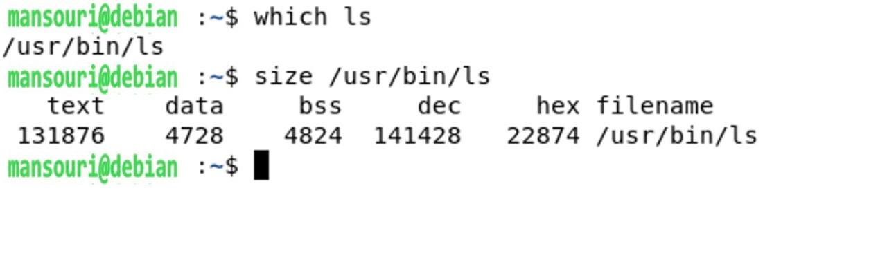

Team Name: 966127035

Student Name of member 1: amin mansouri

Student No. of member 1: 966127035
- [x] Read Session Contents.

## Section 6.4

- [x] Using malloc and free in program
    - 
    - 

    
- [x]  Using ps
    - 

    - [x] Columns description:
-     USER: This field is the effective username. In fact, it is an alias for euser.
-     VSZ:  This field shows the virtual memory size of the process in KB.
-     RSS: This field shows the used physical memory of the process in KB. It is the abbreviation for Resident Set Size.
-     PMEM: This field, as shown in the picture, is an alias for %MEM. It shows the ratio of the RSS to the physical memory of the system in percent.
-     FNAME: This field, as shown in the picture, is an alias for COMMAND. It shows the first 8 characters of the process executable file.

- [x]  Getting started with memory segments
    - 
    - 
    - [x]  As shown in the picture, text, data, bss, dec, hex, and filename are shown in the size command. However, Command-line arguments, environmental variables, heap, and stack are not shown in the output of the size command since they are runtime-specific variables.
    

- [x] Getting started with memory sharing
    1. 
    1. 
    1. 

- [x] Getting started with addresses
    1. [x] According to man etext, etext is the first address past the end of the text segment (the program code). Moreover, this variable, in addition to edata and end must be explicitly declared in order to be used in the program. (They are not defined in any headers.)
    2. [x]  As shown in the picture, the addresses are in the same order as the instruction image suggests. (etext has lower address than edata and edata has lower address than end.)
    - 
    3. 
    4. [x]  As shown in the picture, the address of the stack decreases every time i is declared. This also aligns well with the instruction picture where the stack value decreases.
    - 